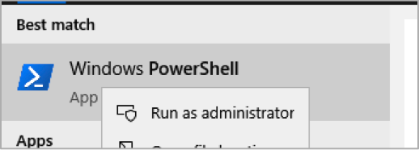
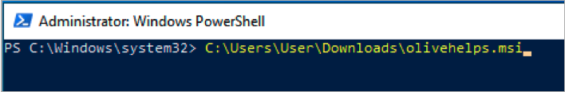
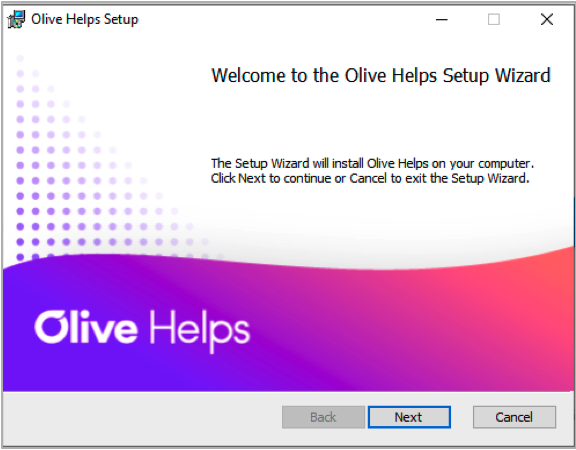
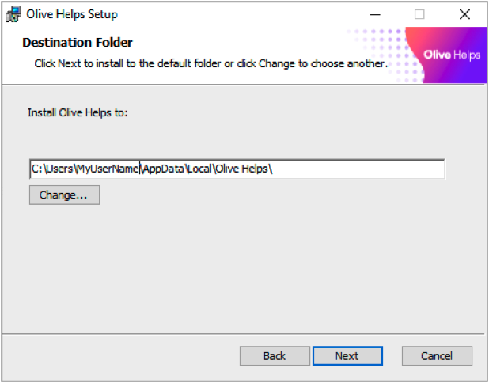
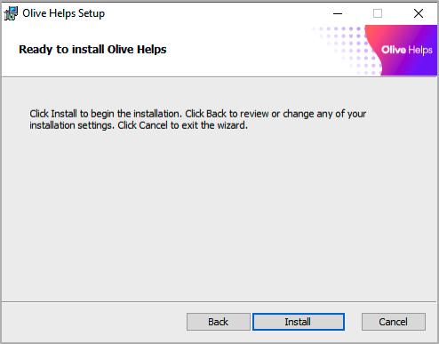
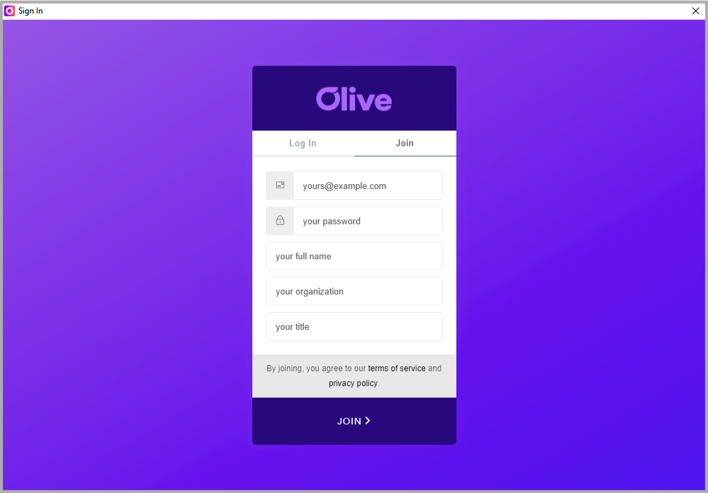
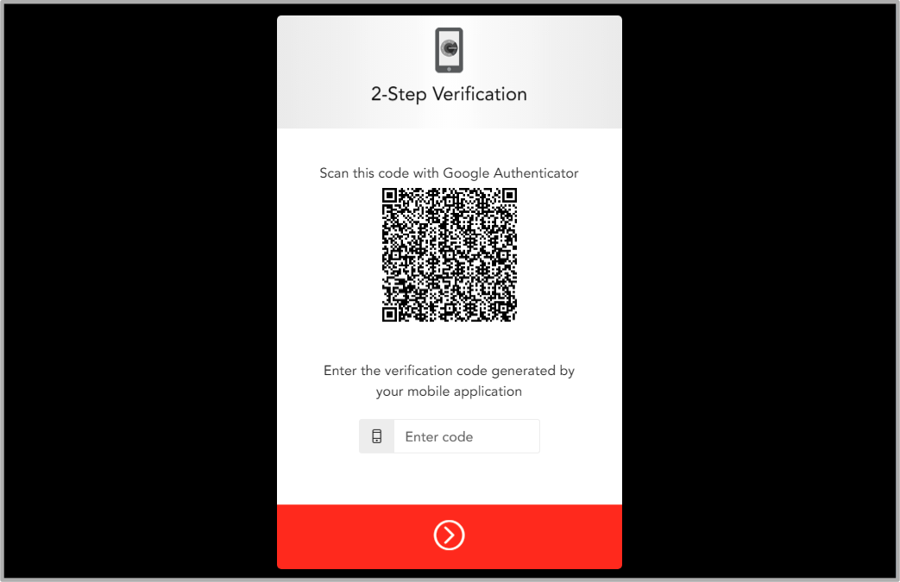
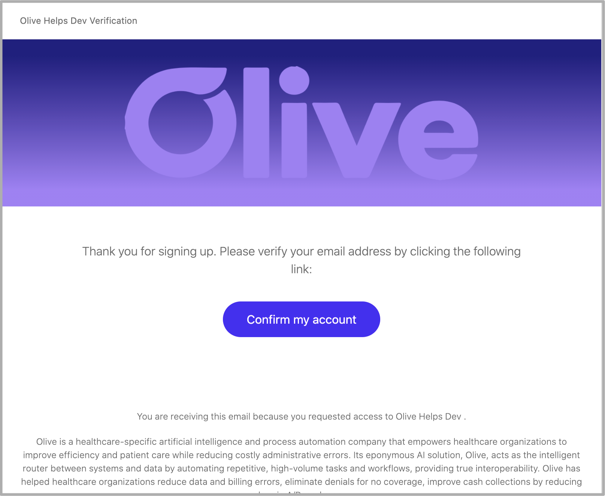
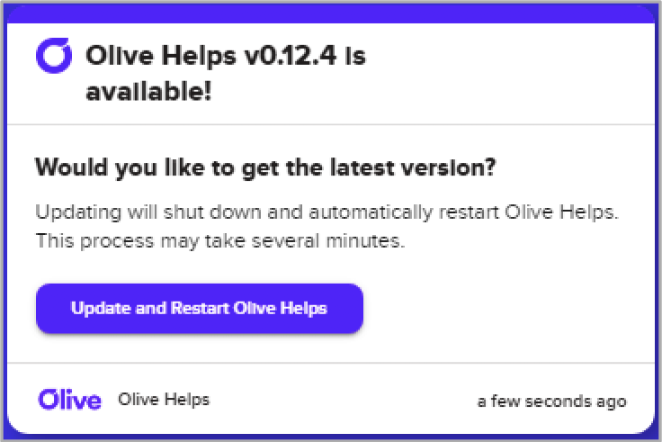

# Requirements

- Windows 10 or macOS 10.15
- To experience Olive Helps with its full capabilities and enhanced security, you should have Windows 10 or macOS 10.15+
- Admin Access
- You will need the ability to install Olive Helps as an administrator. This is covered in detail in the Installation section.

# Installation

## Download Olive Helps

To Download the Olive Helps installer, choose the link below for your operating system. Note: you will not see a new webpage - it will just start the download.

[Windows 10 Installer](https://olive.page.link/olive-helps-windows) (.msi file)

[macOS 10.15+ Installer](https://olive.page.link/olive-helps-mac) (.dmg file)

 

## Launch the installer (normal)

Most users will be able to install Olive Helps simply by clicking on the downloaded installer. However, if you find that you need to run the installer as an admin, you can follow these steps.

## Launch the installer (if you require admin access to install)

In some environments, you will need to run the installer as an administrator. This process shows how to do that and assumes that you have administrator rights. If you do not have administrator rights and you are not allowed or able to install using the normal mode above, then you will need to work with your IT administrator to have Olive Helps installed.

### Launch powershell as an administrator

Search for powershell in the start menu, then right-click and choose “run as administrator”. You will be prompted for an administrator password.

### Run the installer (from PowerShell)

Run the installer by typing `C:/User/MyUser/Downloads/olivehelps.msi`

## Step through the installation wizard

### Start the installation wizard by clicking “Next”

### Accept the EULA

### Double check the install path

When you get to the “destination folder” step, make sure that you see your username in the install so that it looks something like:

`C:\Users\myusername\AppData\Local\Olive Helps\`

### Finally, click “install”, then “finish”

### The installation is done.

That’s it for installing Olive Helps. Now you should see the Olive Helps icon on your desktop and in your start menu.

## Launch Olive Helps

To give Olive Helps the right permissions, you will need to launch it as an administrator.

### Launch Olive Helps for the first time

Double click on the Olive Helps icon on your desktop.

### Create your Olive account

Click on the “join” tab, then fill out the form and submit to create your account.

### Setup 2-step verification

We require 2-step verification (2FA/MFA) to login to Olive Helps. So you’ll need to use your MFA app (DUO in your case) to set this up. Open Authy, DUO, or your MFA app of choice, click the plus icon, then scan the QR code shown in Olive Helps.

### Verify your account

Go to your email client and look for an email titled “Olive Helps verification”. Open it and click the “Confirm my account button. This will open a browser window to verify your account. You can now close your browser.

## Add a Loop

### Open the Loop Library

To install a Loop, you should open the Loop Library using the icon in the footer of Olive Helps.

If there are any Loops available to you that you want to add, simply click the “Add” button to add this Loop to your installation of Olive Helps.

# Updating Olive Helps

If there is a new version of Olive Helps available, you will see a new Whisper appear when you start Olive Helps. Simply click the “Update and Restart Olive Helps” button, then wait for Olive Helps to start back up. **Please be patient as this can take several minutes.**

