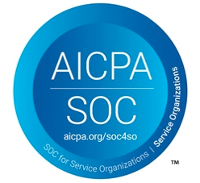
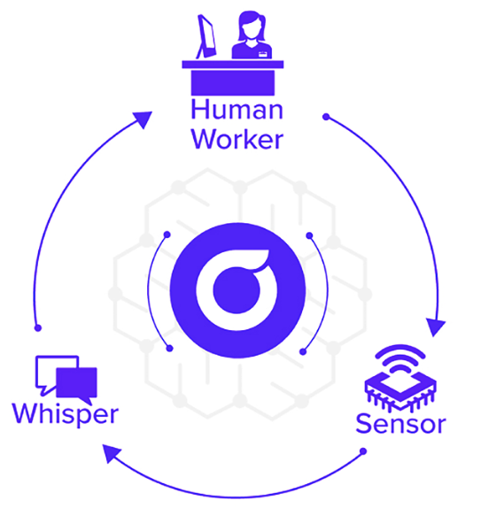
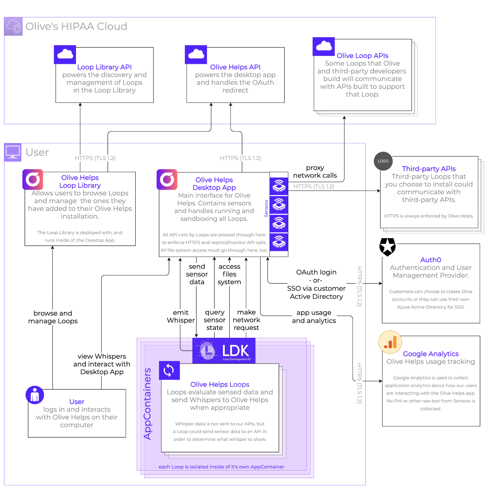

    <mark>The Olive Helps platform is designed with the security of your data and information at its heart.</mark>

||||
|---|---|---|
|Olive participates in yearly audits and attestation of its security controls. This SOC 2 Type 2 report and attestation can be provided upon request|Olive maintains corporate policies and processes inspired by the National Institute of  Standards and Technology 800-53 Rev 4 Medium Risk framework.|Olive Helps has been designed from the ground up focused on the audit, storage, and     transmission of protected health information (PHI).|

---

*Sensors* **trigger** *Loops* **that produce a** *Whisper* **to the human.**

**Cybernetics** – The science of communications and automatic control systems in both machines and living things. 

**Sensor** – Components that allow Olive Helps to observe and learn from the work humans are doing. Ex. Websites, Native Applications, Clipboard, Keystrokes. 

**Whisper** – The intelligence that is being communicated to the human via Olive Helps. 

**Loops** – Loops are analogous to apps in an app store. These loops will be created by Olive, health systems, and technology partners. 

**Loop Library** – The Loop Library is the app store for Loops.

# High-level System Diagram

# Installation / Distribution

## Minimum System Requirements

Olive Helps runs on Windows 8+ or MacOS 10.15+.

## Installation of the Olive Helps components

Olive Helps comprises three main components: the Olive Helps desktop application, the Loop Library, and Loops, but the only thing you need to install is the desktop app.

##Desktop Application

The Olive Helps desktop application is distributed as an MSI based installer which can be deployed using Group Policy or installed directly by a user with sufficient local privileges. The Olive Helps desktop application has built-in support for automatic version updates and security patches. If users do not have permission to update applications, then you will be required to download and push updates using Group Policies or other similar means.

## Loop Library

The Loop Library is bundled with the desktop app and so requires no installation. The Loop Library is accessed through the desktop app and is how users find and add Loops to their installation of Olive Helps.

## Loops

Loops are what make Olive Helps powerful. They are the “apps” of Olive Helps. Some core Loops come out of the box with Olive Helps, while others can be found in the Library and added by a user. Adding a Loop to their own installation of Olive Helps does not require administrative access.

# Loop Security

## Loop Sandboxing

All Loops, whether built by Olive or by a partner, are run in an isolated run-type environment. Each Loop runs in its own sandbox, which allows Olive Helps to create device, file, network, and process isolation. One example of where we use this to make Olive Helps more secure is in the network isolation. Every Loop (by Olive or third-parties) is set to have no network access by default. If a Loop needs to access an specific API, then when a Loop Author submits their Loop to the Loop Library, they must declare that they need network permission and which domain they need to access. When a user adds a Loop from the Library, they can see exactly what a Loop is asking to be able to do. Every API call or other network call that a Loop wants to make, must come through Olive Helps and therefore we can enforce https-only traffic, restrict access to the domains that were declared by the Loop Author and approved by the user, and monitor and log domain access and frequency by every Loop. Everything that a Loop wants to do (read a file, make a network request, etc) can only be done through Olive Helps.

## Loop Signing

All Loops are signed by both the Loop Author and by Olive to ensure the authenticity of the Loops throughout their lifecycle.

## Third-party / Partner Loops

Olive Helps is a platform. One that is most powerful when third-parties contribute their expertise and services in the form of Loops. We also understand the importance of security in healthcare, so we have processes to make sure Loops meet our requirements before being made available to anyone using Olive Helps.

No Loop is made public in the Loop Library without first being reviewed by the Olive team. The Olive team verifies adherence to security practice, user experience guidelines, as well as threat modeling and data flow and asset classification.

If a Loop uses third-party APIs, data will be transferred securely from a user’s desktop to the API using HTTPS enforced by Olive Helps at all times, ensuring encryption at rest and in transit.

It is key to note that some of the Loops in Olive Helps may install content in the binary on a user’s local machine that will not make a call out to any servers. A majority of these Loops will request the most updated content from a provisioned source. For instance, an NPI might trigger a Loop that makes a call out to a provider dictionary which is maintained as a central service by Olive.

# User Management

Olive Helps has 2 forms authentication: OAuth using an Olive account or SSO using Active Directory.

## Olive Accounts

Users of Olive Helps can sign up for and log in with an Olive account. These accounts have strict requirements like email verification, minimum password strength, password reset frequency, and require TOTP-based multi-factor authentication.

## Active Directory Accounts / Single Sign-on

For enterprises that use Azure Active Directory, we support SSO by allowing your employees to use your organization’s Azure AD domain to login to Olive Helps. Users who have Olive Helps installed would be able to sign in using their existing authenticated AD credentials and will be provided access to use the desktop application based on their inherited AD policies. Please note that although we do sync groups from your Azure AD domain upon login, we do not currently leverage those to drive permissions. When it comes to questions like “what PHI would logging in give you access to”, the answer is: when a user logs in to Olive Helps, they don’t get access to any extra PHI that the user didn’t already have permission to access. Based on the way Olive Helps works, it accesses what the user can see and does what the user can do - it doesn’t have any inherent permission or access of its own.

To allow your employees to login to Olive Helps using their Azure Active Directory accounts, there are two steps that you or your IT/IAM team needs to complete.

1. Send your Olive contact the Azure AD domain and the list of IdP domains (list of email domains that can be authenticated in their Azure AD). This will be used to configure our Authentication provider with the information needed to enable this enterprise connection - including being able to map your list of email domains to your organization’s Azure AD domain.
2. Once we configure our Auth provider with this information, an Azure AD administrator will need to approve our registered Azure app for your Azure AD domain. We will let you know when we are ready for you to do this step. You can further refine who can login to Olive Helps through Azure AD, but this isn’t something that Olive suggests unless you think that it’s necessary to keep certain users from leveraging your AD domain for logging in to Olive Helps.

# Sensors

## What are Sensors?

Sensors are a core part of what makes Olive Helps work. Sensors are built into the Olive Helps desktop application and are what allow Olive Helps to understand what a user is doing in order to deliver the value when it’s needed instead of when someone seeks it out. A simple example of a Sensor is the clipboard Sensor, that can be used to detect when content has been copied to the user’s clipboard. If the user had a Loop added to Olive Helps that verifies phone numbers, then the act of copying a phone number could trigger the Loop to tell the user if that phone number is valid.

There are Sensors to watch the clipboard, typing, windows being opened, text on-screen, etc. All of which can be combined to give a holistic view of what the user is doing, so that Olive can help.

## What happens to all that sensed data?

You’re probably wondering “is Olive Helps a keylogger that ships everything users type to your cloud?” In short, the answer is: no. All the sensed data (ex. keystrokes) is not intrinsically sent to our API. Sensed data can be kept in-memory in the local Olive Helps installation for short periods of time, but is then sent to any locally installed Loops that may need that kind of sensed data. In the “phone number verification Loop” example above, the phone number copied to the clipboard is passed to that Loop. Keep in mind that there are some Loops that will need to send some of the data to an API in order to accomplish the task for the user. Using the above example again: if that Loop detects a phone number, then it would likely need to send that phone number to their API to verify it. Some Loops may run off of embedded datasets and some Loops will need to send data to an API to get an answer. Loops that need to use an API will need to clearly state that when being submitted to the Loop Library and will be clearly stated for the user to see in the Library as well. Furthermore, we will enforce that they only communicate with the APIs listed and will monitor how often an API is called.

Metrics/metadata about sensed data will also be sent to Olive’s HIPAA cloud. For example, Olive Helps might collect things like how many words a person types or time spent in specific applications. These are meant to understand how people work and how Olive Helps can add more value over time - they are not meant to record everything that someone types, for example.

## <mark>Full list of sensors available to be leveraged by Loops</mark>

Each Loop can take advantage of the built-in Olive Helps Sensors. It's worth noting that although the term "sensor" might imply something that only senses/reads what is happening on a computer, in some cases a sensor is used to send/write data. For example, you’ll notice that the File System Sensor can sense changes to files, but can also be used to write files. This is part of our sandboxing strategy. Everything that a Loop wants to do (read a file, make a network request, etc) can only be done through one of the Olive Helps sensors.

### Clipboard

Query clipboard content, listen for clipboard changes, and write to the clipboard.

### Cursor

Query cursor position and listen for cursor position changes.

### File System

List directory contents, get file information, listen for file changes in a directory or of a specific file, and read/write/delete both files. For reading/writing to files, the Loop can choose to use built-in Olive Helps encryption or not depending on the needs of that Loop. We recommend always using the encrypted read/write, but there are some cases where that doesn’t make sense - for example, if the Loop needs to create a report that is put into the user’s home folder or shared drive for consumption outside of Helps, it would need to be put there unencrypted.

### Keyboard

Listen for key presses (characters or hot keys) and listen for keyboard utterances (string of keypresses before a pause).

### Network

Make a standard HTTPS request or establish a Secure Web Sockets connection.

### Process

Get a list of the current running processes and listen for start/stop of processes.

### Search

Listen for terms typed into the Olive Helps search bars.

### Vault

Read, write, and delete encrypted data in the OS’s keychain/credential-store for the calling Loop.

### Browser (future)

Query or listen for the currently active browser URL and currently selected text on a web page.

### Hover (future)

Query or listen for the text that is currently being hovered over.

### User (future)

Access the Olive Helps user. Access to the user’s email address, Olive user ID, and temporary JWT as part of an OAuth-like flow.

### Window (future)

Query or listen for the currently focused window or all the open windows.

# Telemetry / Audit Logs

Along with the sensor metrics mentioned above, The Olive Helps desktop app captures usage data / telemetry for analysis by Olive to continue improving. Whenever a Loop is triggered by a Sensor, when a user interacts with Olive Helps, etc, these events will be sent to Olive’s HIPAA cloud with the user context. User telemetry will be stored in Olive’s cloud to track overall utilization across users and across Loops. Just like everything else that Olive Helps does, this will be encrypted at rest and in flight and will be handled with the same level of security and controls as any other data we process.

# Frequently Asked Questions

## Does the Olive Helps app have any software dependencies?

No. The Olive Helps desktop app is built using Golang and a web technology wrapper and is not dependent upon external runtime environments such as the JVM, NET CLR, or a script interpreter.

## Can a Loop call out to a third party API?

Yes, Loops can be written to communicate with third party APIs or APIs hosted on the servers of the Loop Authors. Olive will require and enforce that these Loops follow standards around communication security, clearly documenting what information is sent to the API, that appropriate high availability and auditing capabilities are deployed, and that the service is HIPAA compliant or better. Information about all API calls being made by Loops is recorded by Olive Helps. Not the contents of a request, but things like the domain, method, and frequency.

## What happens if a Loop is found to be problematic (nefarious, performance impacting, usability issues, etc)?

If a Loop or a specific version of a Loop is found to be a problem, Olive is able to remotely remove a Loop from all instances of Olive Helps in near-real-time to mitigate any further issues. If this occurs, users of the Loop will be notified in Olive Helps that a Loop has been removed.

## Does Olive Helps encrypt data in flight and at rest?

Yes, like any other Olive product, we always ensure data is encrypted in flight and at rest. This applies both to the locally running Olive Helps desktop application and to any Olive services it interacts with. All network traffic uses HTTPS (TLS 1.2) and data stored in our HIPAA cloud is encrypted using SHA256. Even third-party Loops are ensured to only communicate over HTTPS.

## Since Olive Helps comes with a keyboard sensor, will it record typed passwords?

As mentioned in the Sensors: What happens to all that sensed data? section above, Olive Helps does not record everything someone types. However, it will sense and locally process passwords just as it processes everything else that is typed. A typed or copied password could be passed to a Loop, which in turn could pass it to an associated API if that Loop decided the string in question met the criteria to be sent. Olive Helps doesn’t currently have the ability to enforce that Loops ignore passwords, though it is best practice for Loop Authors to write Loops which only react to sensed text in certain contexts. For example, if you’re validating patient phone numbers, then maybe you only want to handle text you see if the person is currently looking at the scheduling view in the EMR. Determining if best practices have been followed is part of the Loop review process.

## Can I disable a specific Sensor?

You cannot disable specific Sensors inside of Olive Helps. Every Loop will clearly define which Sensors it needs access to in order to function, so you can always decide not to install Loops that utilize specific sensors if you choose to. If there are certain tasks that a user doesn’t want a Loop to watch, that user can pause a Loop. And if there is something the user doesn’t want any part of Olive Helps watching, they can quit the Olive Helps desktop app.
It is worth noting that some of the Sensors that Olive Helps uses require OS-level permissions (say for keyboard recording). It is not recommended, but there are certain Sensors that you could render inoperable by removing the OS-level permission.

## As a Loop Author, who will I sign a Business Associate Agreement (BAA) with?

Loop Authors will most frequently sign a BAA with Olive as a downstream vendor. Any provider organization that has already deployed Olive Helps can add your Loop without needing to engage in a BAA directly with you. In other words, you sign one BAA with Olive and Olive will take care of that relationship for every health system that uses, or will use, Olive Helps.

## As a Loop Author, do I need a SOC Audit or HITRUST Certification to build a Loop for the Loop Library?

No. Olive will perform a security review with the Loop Author prior to the Loop being published into the Loop Library. Having a SOC or HITRUST will speed up the review process, but is not required.
