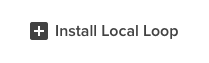

# LDK Development

## New Loop: Getting Started
### Producing Loop Compilations
We recommend using Webpack 5 to compile your Loop code for you. Our Webpack configuration includes support for Typescript, and generates the Loop metadata required for installation.

### Using Our Configuration As-Is
Install Webpack 5 and its CLI, and add this build script to your `package.json`:

```shell
webpack --entry core-js/fn/promise --entry ./index.js --config ./node_modules/@oliveai/ldk/dist/webpack/config.js
```

This will use the LDK webpack configuration and compile the file to the `./dist/loop.js` directory.

### Extending the Configuration
If you want to extend the Webpack configuration, create a webpack.config.js file and use `webpack-merge` to extend it:

```js
const path = require('path');
const merge = require('webpack-merge');
const ldkConfig = require('@oliveai/ldk/dist/webpack/config');

const merged = merge.merge(ldkConfig.default, {
  entry: [path.resolve(__dirname, './index.js')],
});

module.exports = merged;
```

### Loop Permissions
In order to ensure your Loop is executing in a secure manner, you must declare which network URL domains, file system path globs, and aptitudes your Loop will use. Each permission must also include a reason for letting the user know why the Loop is requesting certain permissions.

Permissions are declared inside of the Loop `package.json` root within a `ldk/permissions` json object.

```json
"ldk": {
  "permissions": {
    "clipboard": {
      "reason": "To monitor the users clipboard"
    },
    "filesystem": {
      "pathGlobs": [
        {
          "value": "/some/path/something.txt",
          "reason": "To read the shared file"
        }
      ]
    },
    "network": {
      "urlDomains": [
        {
          "value": "*.google.com",
          "reason": "For Google searches"
        }
      ]
    },
    "window": {
      "reason": "To monitor users window activity"
    }
  }
},
```

#### Network Permission:
Any domain URL reference. Supports domain wildcards. Each urlDomain must contain a reason.
```json
"ldk": {
  "network": {
    "urlDomains": [
      {
        "value": string,
        "reason": string
      }
    ]
  }
}
```
Examples
| Value | Reason |
-----------|-----------
"*.google.com" | "For Google searches"
"github.com/" | "Access Github to check pull requests"
"en.wikipedia.org" | "Fetch information from Wikipedia"
<br>

#### Filesystem Permission:
Any filesystem path. Supports path wildcards. Each pathGlob must contain a reason.
```json
"ldk": {
  "filesystem": {
    "pathGlobs": [
      {
        "value": string,
        "reason": string
      }
    ]
  }
}
```
Examples
| Value  | Reason |
-----------|------------
"/some/path/something.txt" | "To read the shared file"
"/Users/ldkuser/Desktop/*" | "To access documents on users desktop"
<br>

#### Aptitude Permission:
An Aptitude Name. Each aptitude must also include a reason.
```json
"ldk": {
  "clipboard": {
    "reason": string
  },
  "network": {
    "reason": string
  }
}
```
| Valid Options |||
|-----------|---------| --------- |
| "clipboard" | "cursor" | "filesystem" |
| "keyboard" | "network" | "process" |
| "ui" | "vault" | "whisper" |
| "window" |

| Reason |
|--------|
"To monitor the users clipboard"
"To make network requests"
"to monitor users filesystem"

<br>

### Loop Examples
Examples are provided in the `ldk/javascript/examples/` directory. These examples include more information about creating and building Loops.

## Loading a Local Loop Into Olive Helps
Once you have generated the Loop using the above steps into your `./dist/loop.js` directory, you can now load it into Olive Helps to test.

- Open up Olive Helps and authenticate
- Click "Loop Library"


- Click "Local Loops"


- Click "Install Local Loop"



- Fill out the required Loop data, and browse to your `./dist` directory via the "Local Directory" dialog


You will see a toast within Olive Helps if your Loop was started.

### Guidelines and Warnings
* The Goja runtime is not the same thing as the Node runtime, and built-in Node modules (like `fs`, `path`) are not available.
* You can install npm packages and use them in your code, however Webpack will not throw a compilation error if a package you import requires a Node built-in module. Instead it will generate an error at runtime.
* Olive Helps expects that the compilation folder is empty besides the `loop.js` file.
* Multiple file chunks are not supported.